This capstone project is the part of Azure Machine Learning Nanodegree. In this project we aim to predict breast cancer using Azure Machine Learning SDK. 

# Health Analytics: Breast Cancer Prediction

Breast cancer has now overtaken lung cancer as the [world’s most commonly diagnosed cancer](https://www.who.int/news/item/03-02-2021-breast-cancer-now-most-common-form-of-cancer-who-taking-action), according to statistics released by the International Agency for Research on Cancer (IARC) in December 2020. Diagnosis of breast cancer is performed when an abnormal lump is found or a tiny speck of calcium is seen. Cancer also known as tumor must be quickly and correctly detected in the initial stage to identify what might be beneficial for its cure. Once a suspicious lump is found, the doctors conduct a diagnosis to determine whether it is cancerous and, if so, whether it has spread to other parts of the body. At a fundamental level, machine learning can be helpful to improve the basic detection of cancer development and progression.

In this project we use a breast cancer dataset to predict if a cell is cancerous or not. We will use Microsoft Azure ML SDK to create two models - i) the AutoML model and ii) the Hyperdrive-tuned Logistic Regression model.

## Project Set Up and Installation
In this project we trained two models. The first model is the AutoML model that is developed by creating an AutoML run from Azure ML Python SDK. The second model is a Logistic Regression model where two hyperparameters - `C` (Inverse of regularization strength) and `max_iter` (Maximum number of iterations taken to converge) are tuned by Azure ML's Hyperdrive. We finally chose the Hyperdrive-tuned Logistic Regression model based on the metric accuracy.

The steps used for this project are summarized below:

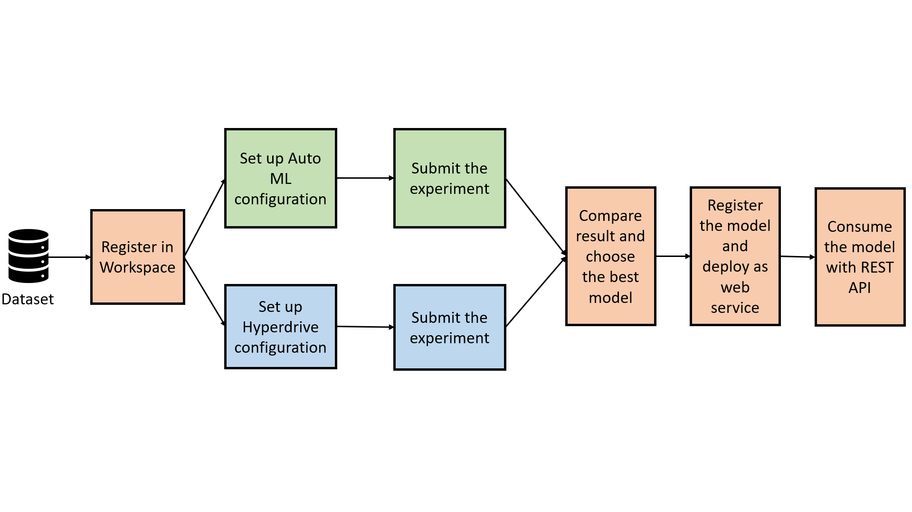

## Dataset

### Overview
Here, we used the breast cancer dataset from [Kaggle](https://www.kaggle.com/merishnasuwal/breast-cancer-prediction-dataset). We aim to predict if a cell is cancerous or not from its physical features. 

### Task
The dataset contains 6 columns. The first five columns contain different physical features of cells. These five columns contain float values. The sixth column is the target column or dependent variable. It is a binary variable containing 1 and 0 as values where 1 means cancerous cell and 0 means non-cancerous cell. Column details are given below:

- mean_radius: mean radius value of the cell (decimal value)
- mean_texture: mean texture value of the cell (decimal value)
- mean_perimeter: mean perimeter of the cell (decimal value)
- mean_area: mean area of the cell (decimal value)
- mean_smoothness: mean smoothness value of the cell (decimal value)
- diagnosis: diagnosis result or target variable (0/1)

### Access
The dataset is accessed by uploading the csv file downloaded from Kaggle into Microsoft Azure ML workspace.

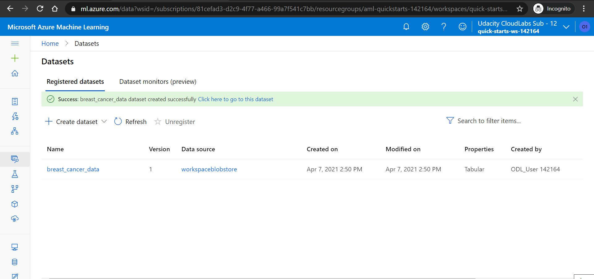
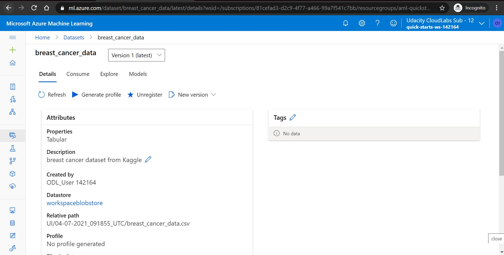

## Automated ML
Azure ML provides Automated machine learning (Auto ML) feature which is the process of automating the time consuming, iterative tasks of machine learning model development.

Here are the configurations and settings used for the AutoML experiment:

```
automl_settings = {
    "experiment_timeout_minutes": 30,
    "max_concurrent_iterations": 5,
    "primary_metric" : 'accuracy'
}

automl_config = AutoMLConfig(compute_target=cluster,
                             task = "classification",
                             training_data=train_data,
                             label_column_name="diagnosis",   
                             enable_early_stopping= True,
                             featurization= 'auto',
                             blocked_models=['XGBoostClassifier'],
                             debug_log = "automl_errors.log",
                             **automl_settings
                            )
```

Breast cancer prediction is a binary classification task. The label column or target column is `diagnosis`. We used "accuracy" as the primary metric here. Iterations are processed concurrently to speed up the training process. We also enabled early stopping to prevent overfitting. Featurization includes automated feature engineering.

### Results

The best model we got from the experiment is `VotingEnsemble`. We got an accuracty of 94%. The accuracy can be improved by enabling the XGBoost and Deeplearning models and also by increasing the experiment timeout. Performance can also be improved by considering oversampling/undersampling to avoid the class imbalance issue.

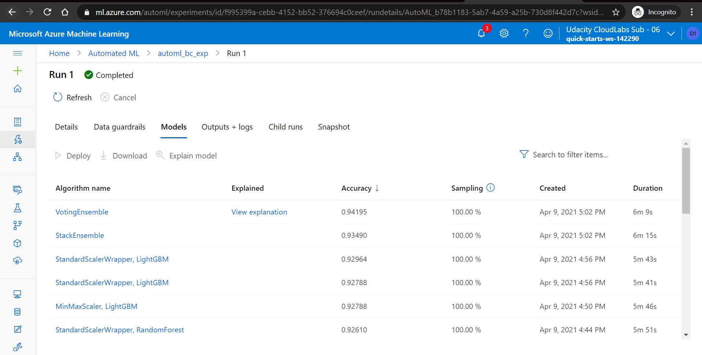
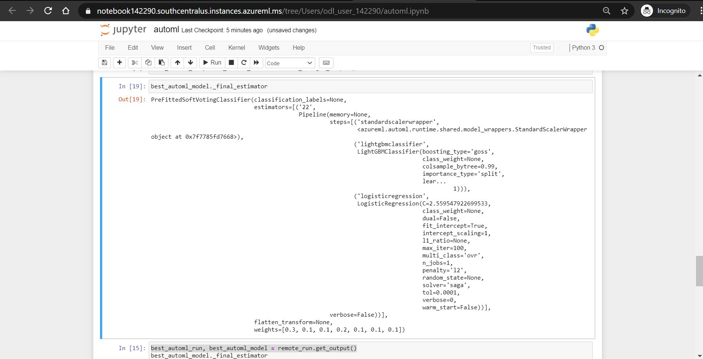

The best run details can be seen in Notebook. Below screenshot shows AutoML best model with its run id and best run's accuracy as 0.940163:

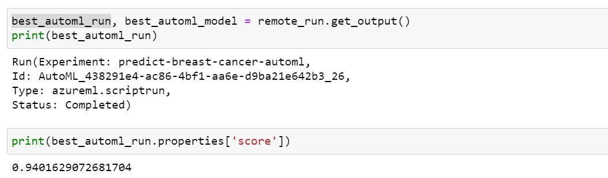

Here is the screenshot of the RunDetails widget:

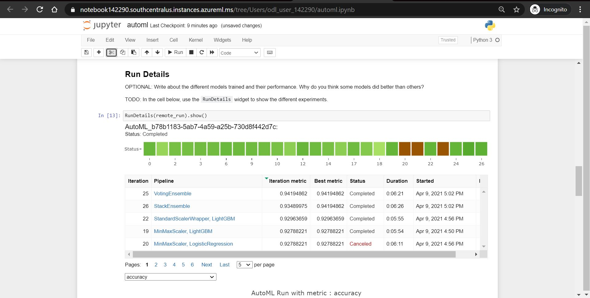

Best model's logs can be seen from the widget on notebook:

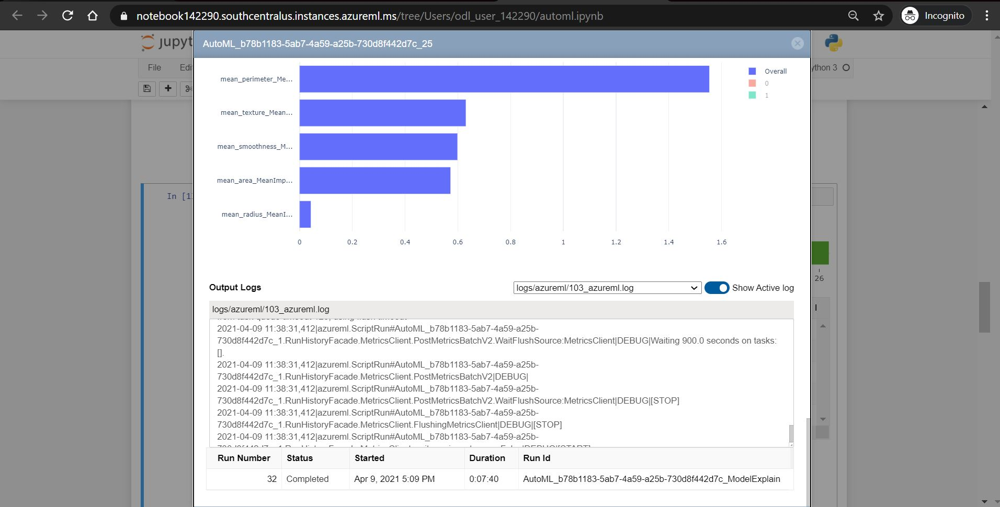

The confusion matrix for the classification task generated by the best model can be seen from the widget on notebook:

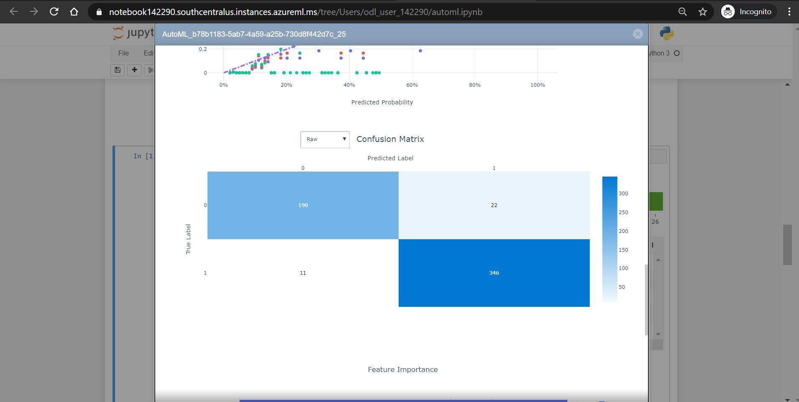

The metrics transformation chart for the classification task generated by the best model can be seen from the widget on notebook:

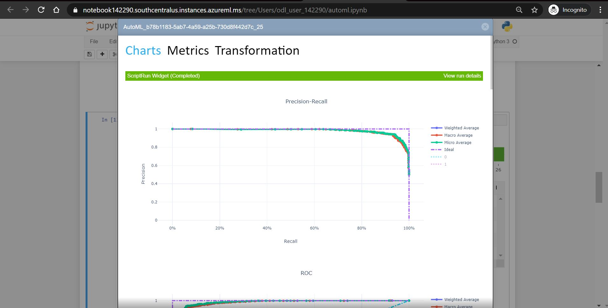

Best Auto ML model can be registered from Notebook:

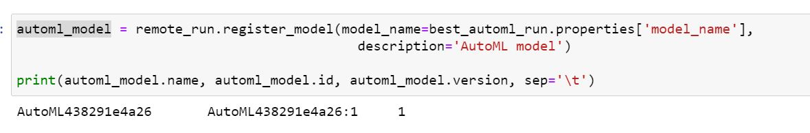

Registered model can be seen now in Model section of the studio:

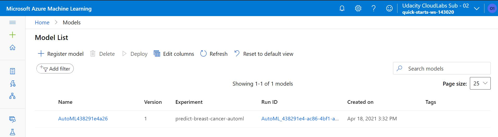

Best Auto ML model can be registered from Notebook in another way too. Here we can explicitly provide the model name and path (the pkl file):

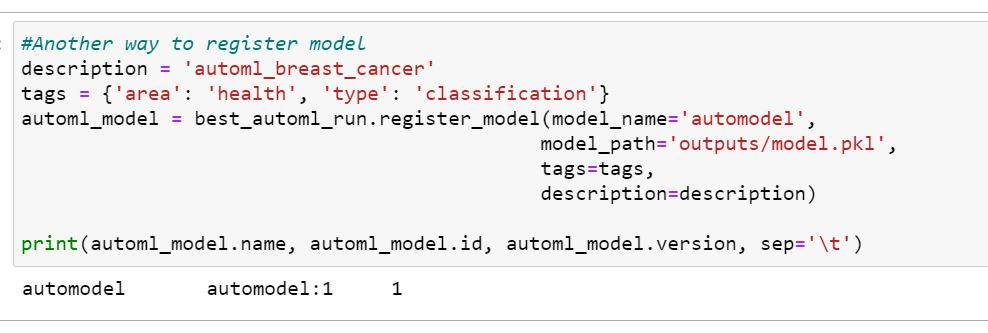

This newly registered model also be seen now in Model section of the studio:

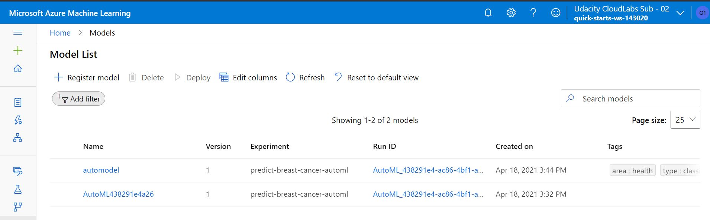

AutoML model details:
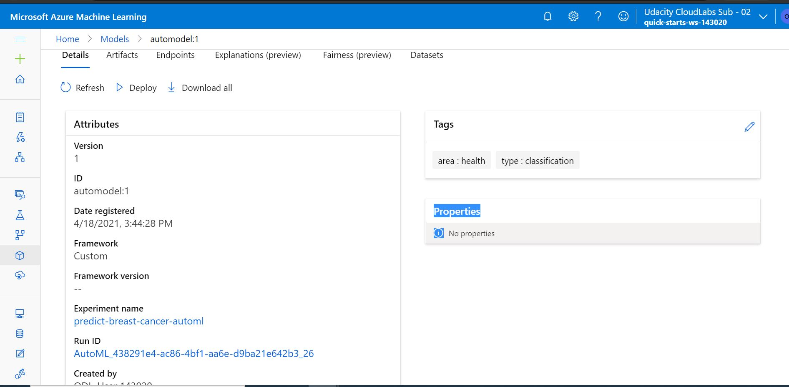

Model's pkl file generated:
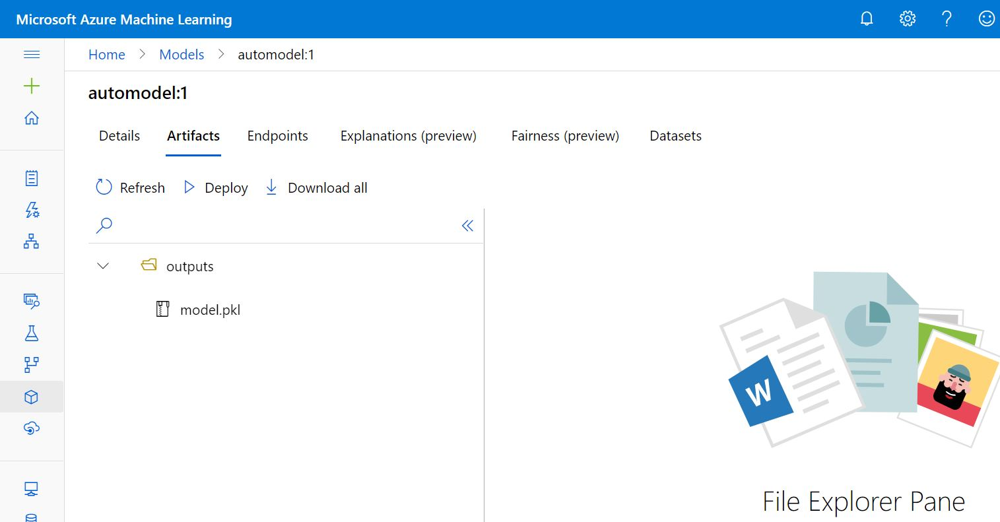


## Hyperparameter Tuning

I chose a Logistic Regression mnodel for this classification task. The reasons behind choosing this models are:

* I found that the target variable is linearly separable using the input features.
* Logistic Regression is easy to explain than other complex algorithms. 
* It is simple to train.

The range of hyperparameters:

We tuned two hyper parameters here:

* C (Inverse of regularization strength): It was set to choose from 0.01, 0.1, 1 and 10. Regularization helps to prevent the model from overfitting by penalizing unnecessary features.

* Maximum iterations: It was set to choose from 50, 100, 200 and 500. It is the maximum number of iterations taken for the solvers to converge.

The RandomParameterSampling method was used to search the hyperparameter grid space.

### Results

Our best model tuned with Hyperdrive gave us an accuracy of 95%. The hyper parameters' values were chosen as: C = 0.1 and max_iter = 500.

In addition to upsampling/downsampling of data, we could have set `class_weight` hyper parameter of Logistic Regression model as "balanced" to automatically adjust weights for handling class imbalance. We also could have employed better feature engineering methods to improve the model's performance.

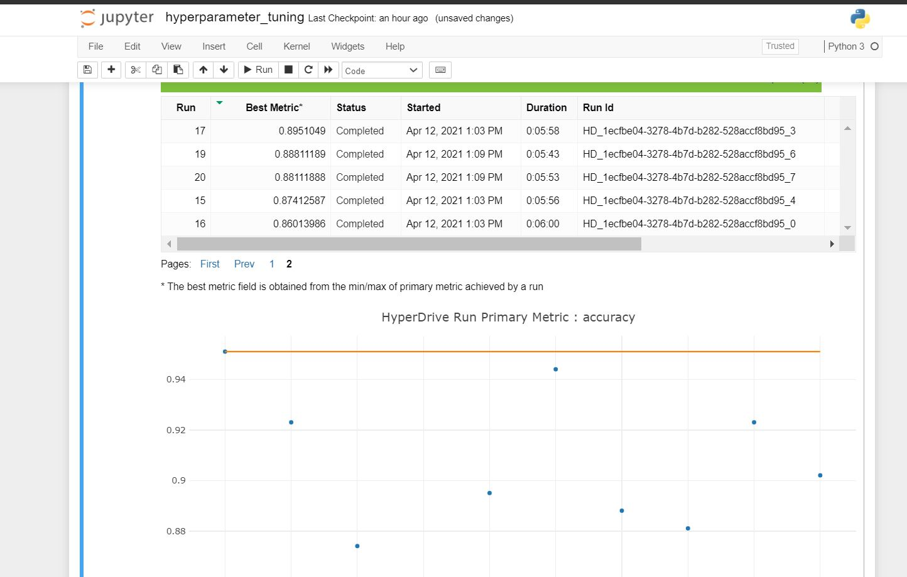
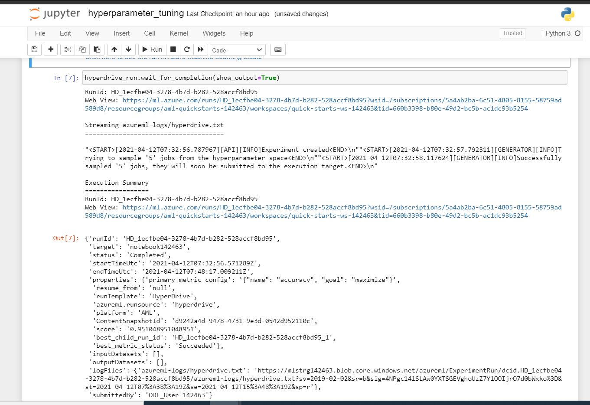

Hyperdrive tuned best model's result:

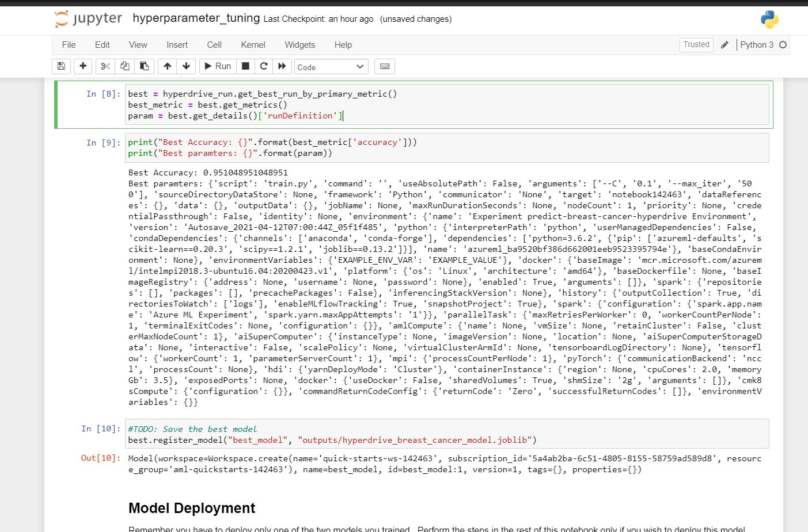

Hyperdrive runs in the Experiment:

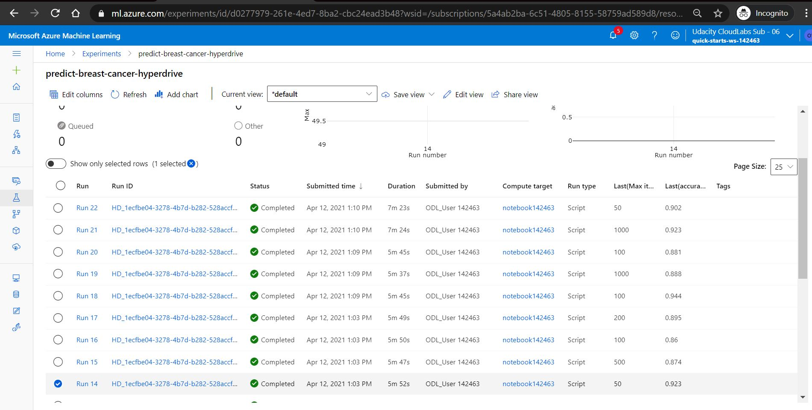
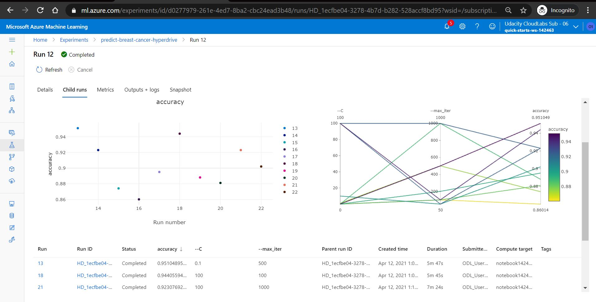


## Model Deployment

We found that the hyperdrive-tuned model gives better accuracy so we chose to deploy the best model found from hyperdrive experiment. The below screen shows the model has been deployed and in Healthy status:

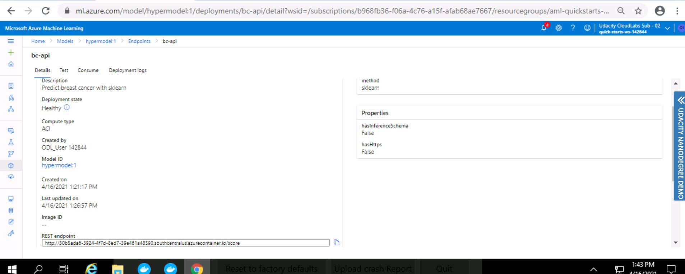

To deploy the model we followed the below mentioned steps:

- We registered the best model by providing the model name. 
- We created the deploy configuration and InferenceConfig by providing the [scoring script](https://github.com/arin1405/nd00333-capstone/blob/master/starter_file/score.py). 
- We deployed the web service with ACI (Azure Container Instance). 
- For querying the endpoint, we can use the REST call with the generated REST scoring URI and primary key.
- We need to send a JSON input data while calling the REST API.
- In response, the model service sends back the prediction result.

A sample data input is shown below:

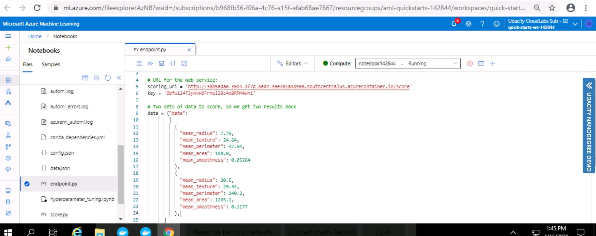

## Result

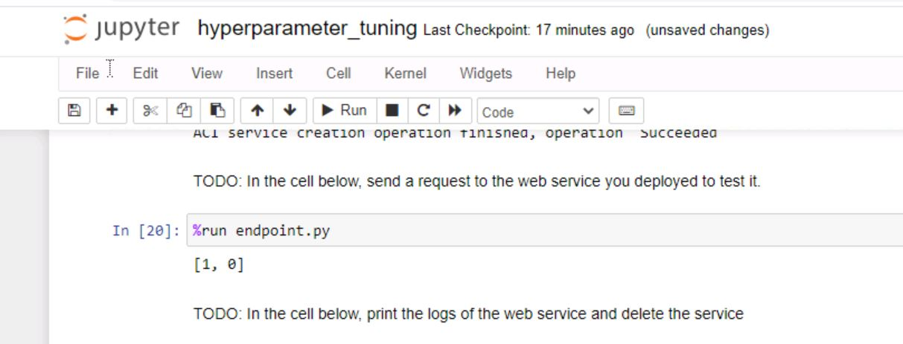

Service is deleted after the task.

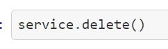

Finally cluster is deleted after the task.

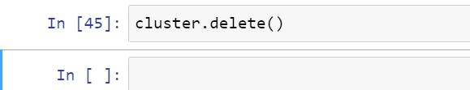

## Screen Recording

[Here](https://youtu.be/Et6lWZ5DVeM) is the screencast recording that demonstrates all the mentioned process.

## Standout Suggestions

Application insights were enabled in the model endpoint to log important metrics.

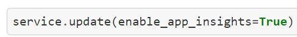
